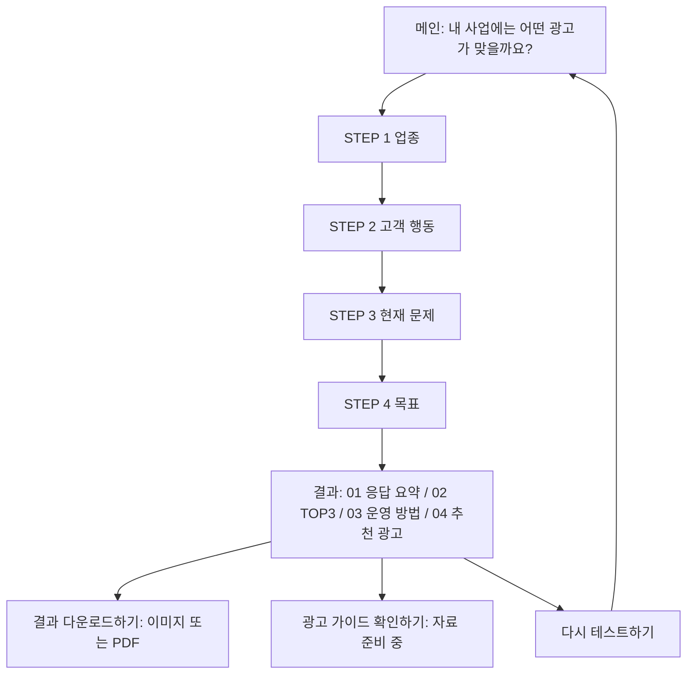

# 카카오 광고 자가 진단 체크리스트

**질문 4개로 우리 사업에 맞는 카카오 광고와 운영 방법을 확인하는 웹 서비스입니다.**

[서비스 바로가기](https://kakao-checklist-web.vercel.app/) · [개발·운영 가이드](CONTRIBUTING.md) · [전체 추천 기준](docs/RESULT_LOGIC.md) · [최신 QA 기록](docs/QA-2026-09-15.md)

> 현재 구현 기준: 2026년 9월 15일. 이전 디자인 및 검증 이력과 현재 동작은 구분해서 기록합니다.

## 서비스 개요

| 항목 | 내용 |
|---|---|
| 대상 | 광고를 시작하거나 운영 방향을 점검하려는 사업자 |
| 진단 방식 | 업종 → 고객 행동 → 현재 문제 → 목표, 단계마다 하나씩 선택 |
| 추천 방식 | 제공된 표를 사용하는 규칙 기반 추천. AI로 결과를 생성하지 않음 |
| 결과 | 응답 요약 + 업종별 TOP3 + 문제별 운영 안내 + 유형별 추천 광고 |
| 이용 환경 | PC·모바일 웹, 가입·설치 불필요 |
| 답변 보관 | 현재 탭의 sessionStorage. 서버에 답변을 저장하지 않음 |
| 다운로드 | PNG 이미지·PDF, 브라우저 안에서 생성 |

## 사용 방법

1. [서비스](https://kakao-checklist-web.vercel.app/)에서 **광고 자가 진단 시작하기**를 선택합니다.
2. STEP 1~4에 답하고 **결과 보기**를 선택합니다.
3. 결과 카드 4개에서 선택한 답변과 광고·운영 안내를 확인합니다.
4. **결과 다운로드하기**에서 이미지 또는 PDF를 저장합니다.
5. **다시 테스트하기**를 선택하면 답변을 초기화하고 처음부터 진행합니다.

선택 전에는 다음 버튼이 비활성화됩니다. 이전·다음과 브라우저 뒤로·앞으로 이동을 지원하며, 같은 탭에서 새로고침하면 답변을 복구합니다. 미완성 상태로 결과 주소에 접근하면 응답하지 않은 질문으로 이동합니다.

## 질문과 추천 로직

| 단계 | 제목 | 선택지 |
|---|---|---|
| STEP 1 | 우리 사업 이해하기 | 식품, 패션/뷰티, 의료/건강, 교육/전문 서비스, 생활/여가, IT/소프트웨어·플랫폼 |
| STEP 2 | 고객 행동 알아보기 | 오프라인 방문형, 예약 전환형, 온라인 전환형, 플랫폼 이용형, 상담 전환형 |
| STEP 3 | 광고 문제 진단하기 | 유입 부족, 관심 부족, 전환 부족, 재구매 부족, 성과 측정 부족 |
| STEP 4 | 광고 목표 설정하기 | 신규 고객 확보, 관심·인지도 높이기, 전환율 높이기, 재방문·재구매 유도 |

총 **6 × 5 × 5 × 4 = 600개 응답 조합**입니다. 선택지의 유형을 위에, 설명을 아래에 표시하며 안내 문구는 ‘선택해주세요’를 사용합니다.

| 결과 카드 | 연결되는 답변 | 표시 내용 |
|---|---|---|
| 01 나의 광고 타입 | Q1~Q4 | 업종·고객 행동·현재 문제·목표 |
| 02 우리 업종에 맞는 광고 | Q1 | TOP3 광고명·순위·추천 이유 |
| 03 지금 필요한 운영 방법 | Q2 × Q3 | 현재 문제·상황 해결·구조 개선·주의 사항, 25개 조합 |
| 04 우리 사업 유형에 맞는 광고 | Q2 × Q4 | 추천 광고 2개·각 추천 이유, 20개 조합 |

- TOP3는 제공된 추천 표 기준이며 실시간 이용량 순위가 아닙니다.
- 모든 고객 행동 유형에 전용 운영 문구를 적용합니다. 이전 온라인·오프라인 동시 안내 분기는 제거했습니다.
- 카드 02와 04에서 같은 광고가 나와도 각 카드의 추천 이유와 순서를 유지합니다.
- 원문의 Q1-1은 별도 질문·규칙이 정의되지 않아 Q1 대분류에 연결합니다.
- 질문과 모든 결과 문구는 [전체 추천 기준](docs/RESULT_LOGIC.md)을 참고하세요.

## 화면 구조와 반응형



- 메인: PC에서는 문구·시작 버튼과 캐릭터를 좌우로, 모바일에서는 **글 → 캐릭터 모션 → 시작 버튼** 순서로 배치합니다.
- 선택지: PC에서는 2열, 작은 화면에서는 1열. 살짝 둥근 사각형이며 다음 버튼은 캡슐형입니다. 넓은 화면의 다음 버튼은 선택지 한 칸 너비에 맞춥니다.
- 결과: 카드 4개에 같은 배경과 둥근 모서리를 적용합니다. 01 카드에 별도 외곽 테두리를 두지 않습니다.
- 문장: 의미 단위 제목, 단어 유지·균형 줄바꿈을 적용합니다. 문제 아이콘과 설명은 두 열로 정렬합니다.
- 모션: 메인 캐릭터의 짧은 등장 모션, 결과 캐릭터의 오른쪽 슬라이드. 동작 줄이기 설정을 지원합니다.

## 디자인 기준

| 요소 | 현재 적용 |
|---|---|
| 글꼴 | 전체 Kakao Big Sans Regular 400 / Bold 700, 로컬 WOFF2 |
| 키 컬러 | 잉크 `#0C090A`, 노랑 `#FAD524` |
| 보조 색상 | 흰 배경, 키 컬러의 투명도를 사용한 옅은 배경·설명 |
| 캐릭터·이모지 | 제공된 원본 색상 유지 |
| 메인·결과 캐릭터 | SVG 원본 사용, 확대 시 비트맵 깨짐 방지 |
| 이모지 | 제공된 TossFace 폰트에서 추출한 PNG. 01 카드에는 초록 체크 |
| 응답 강조 | 01 카드의 응답에 노랑 20% 배경 |
| 제목 강조 | 결과 제목의 핵심 문구에 키 컬러 밑줄 |
| 광고 순위 | 노란 원형 숫자. 02 카드의 1위 광고명에는 밑줄 없음 |
| 현재 문제 라벨 | 04 카드 설명과 같은 옅은 잉크 색 |
| 결과 버튼 | 같은 크기·캡슐형. 다시 테스트하기 → 결과 다운로드하기 → 광고 가이드 확인하기 |
| 버튼 강조 | 다시 테스트하기는 흰색, 다운로드는 옅은 노랑, 가이드는 진한 키 컬러 |

현재 사용 자산은 `public/kakao-main-characters.svg`, `public/kakao-characters.svg`, `public/emoji/`, `public/fonts/`에 있습니다. 원본은 로컬 `data/`에 보관하며 배포에서 제외합니다. [자산 이력](docs/ASSETS.md)에는 이전 시안의 자산도 포함됩니다.

## 결과 다운로드

| 구분 | 이미지로 저장 | PDF로 저장 |
|---|---|---|
| 먼저 표시하는 환경 | 저장 창을 열 때 화면 너비 767px 이하 | 저장 창을 열 때 화면 너비 768px 이상 |
| 저장 배치 | 390px 모바일 배치 | 1080px PC 배치 |
| 출력 해상도 | 3배, 너비 1170px | 2배, 내장 이미지 너비 2160px |
| 파일 | 무손실 PNG | 이미지 기반 단일 긴 페이지 PDF |

두 형식은 접속 기기와 관계없이 모두 선택할 수 있습니다. 파일 높이는 응답 내용에 따라 달라지며 PDF의 텍스트 검색·선택은 지원하지 않습니다.

저장 화면에서 글꼴·이미지 로딩을 완료한 뒤, 측정된 글자 위치·배경·모서리·이미지를 Canvas에 직접 그립니다. 이전 `html-to-image`의 SVG `foreignObject` 저장 경로는 제거했습니다. 현재 `html-to-image` 패키지는 의존성 목록에 남아 있지만 저장 코드에서 사용하지 않습니다.

- 화면 밖의 고정 너비 렌더링 영역을 사용해 현재 화면의 너비·스크롤에 따른 영향을 줄입니다.
- 캔버스 면적 16MP, 높이 16,000px 제한을 적용합니다. 한도 초과·생성 실패 시 오류를 알립니다.
- 저장 버튼에서 바로 다운로드합니다. 중복 ‘파일 다운로드’·‘파일 열기’ 링크는 표시하지 않습니다.
- 실제 아이폰에서 이전 출력의 상단 축소·공백이 보고되어 저장 방식을 교체했습니다. 최신 Chrome·WebKit 출력은 검증했지만 **iPhone 17 Pro의 카카오톡 내부 브라우저·Safari·Chrome에서 사용자 재확인은 남아 있습니다.**

## 광고 가이드

**광고 가이드 확인하기** 창에는 일정한 간격으로 다음 버튼이 배치됩니다.

- 나에게 딱 맞는 광고 가이드 확인하기
- 스타터킷 전체 보러가기

자료 URL이 아직 연결되지 않아 두 버튼은 ‘준비 중’ 상태입니다.

## 기술 스택과 실행

React 19·TypeScript 7·Vite 8·CSS, sessionStorage, Canvas 2D, pdf-lib, Vitest·Playwright, GitHub·Vercel을 사용합니다. 정확한 버전은 [package-lock.json](package-lock.json) 기준입니다.

```sh
npm ci
npm run dev
```

- 기본 개발 주소: `http://127.0.0.1:5173`
- 테스트·빌드: `npm run check`
- 빌드 미리보기: `npm run preview`
- [수정할 파일·커밋 컨벤션·QA·배포 절차](CONTRIBUTING.md)

## 검증 현황

| 범위 | 확인 결과 |
|---|---|
| 단위 테스트·빌드 | 608개 테스트 및 TypeScript·Vite 빌드 통과 |
| 전체 조합 | Chrome PC 600개 + 모바일 에뮬레이션 600개 실제 선택 흐름·결과 문구 대조 |
| 화면·기능 | 답변 복구, 이동, 초기화, 모달, 동작 줄이기, PNG·PDF 다운로드 |
| 반응형 | 320·390·768px 메인 콘텐츠 순서 및 가로 넘침 확인 |
| Safari 계열 | 데스크톱 WebKit에서 PC·모바일 에뮬레이션 및 저장 파일 확인 |
| 사용자 보고 사례 | 같은 답변으로 최신 운영 버전 PNG·PDF를 생성하고 배치·해상도 대조 |
| 실기기 | iPhone 17 Pro의 최신 버전 사용자 재검증 필요. 엔진 테스트를 실기기 통과로 간주하지 않음 |

전체 조합 검증과 후속 렌더러 검증은 각각 수행한 범위입니다. 모든 변경마다 모든 조합을 재실행한 것은 아닙니다. 상세 근거는 [최신 QA 기록](docs/QA-2026-09-15.md), 과거 기록은 [검증 이력](docs/VERIFICATION.md)을 참고하세요.

## 배포와 서비스 주소

`main`에 푸시하면 연결된 Vercel 프로젝트에서 자동 배포됩니다. 계속 공유할 주소는 **https://kakao-checklist-web.vercel.app/** 입니다.

배포 전에 열어둔 화면은 이전 코드가 남을 수 있습니다. 새로고침하거나 카카오톡 내부 창을 닫고 다시 여세요. 확인용으로 붙였던 `?v=...`는 별도 버전 서비스가 아니며, 일반 공유에는 필요하지 않습니다.

## 관련 문서

- [CONTRIBUTING](CONTRIBUTING.md): 개발·수정·검증·커밋·배포
- [전체 추천 기준](docs/RESULT_LOGIC.md): 승인 원문과 모든 매핑
- [최신 QA 기록](docs/QA-2026-09-15.md): 전체 조합·모바일 저장·첨부 PDF 대조
- [검증 이력](docs/VERIFICATION.md): 이전 검증 결과
- [자산 이력](docs/ASSETS.md): 폰트·이모지·이미지 출처
- [PRD 및 변경 이력](docs/PRD.md): 과거 제안과 변경 과정, 현재 구현은 본 문서·코드 기준
