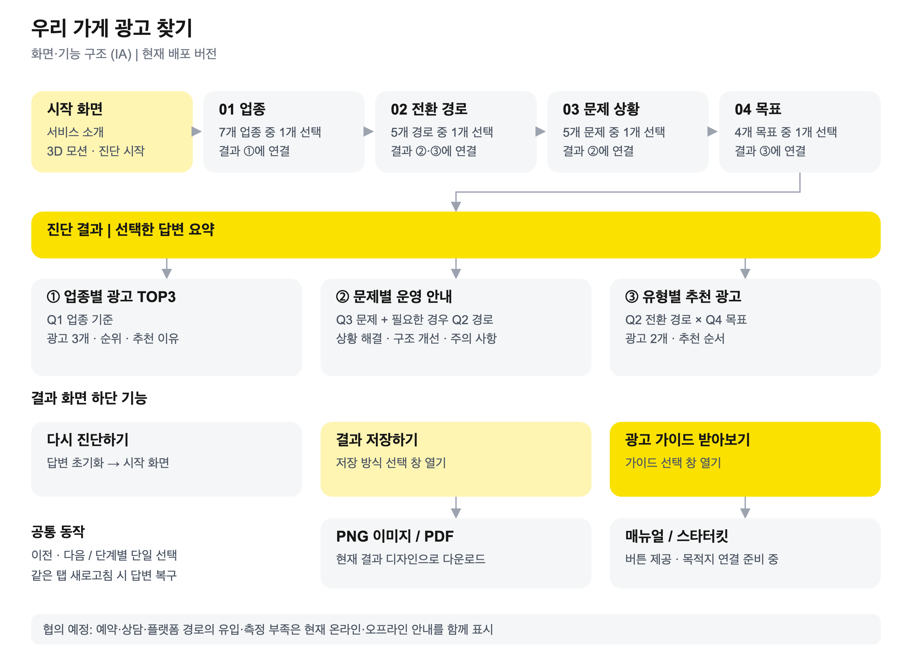

# 우리 가게 광고 찾기

**객관식 질문 4개로 우리 가게에 맞는 카카오 광고와 운영 방법을 확인하는 웹 서비스**

[서비스 바로가기](https://kakao-checklist-web.vercel.app) · [개발·운영 가이드](CONTRIBUTING.md) · [전체 결과 로직](docs/RESULT_LOGIC.md) · [QA 기록](docs/VERIFICATION.md)

## 서비스 개요

| 항목 | 내용 |
|---|---|
| 목표 | 사업자가 활용할 광고와 먼저 개선할 운영 사항 안내 |
| 대상 | 광고를 시작하거나 운영 방향을 점검하려는 소상공인·사업자 |
| 질문 | 업종 → 전환 경로 → 문제 상황 → 목표·각각 1개 선택 |
| 결과 | 업종별 광고 TOP3 + 문제별 운영 안내 + 유형별 추천 광고 2개 |
| 추천 방식 | 제공된 표를 사용하는 규칙 기반 진단·AI 결과 생성 없음 |
| 이용 환경 | PC·모바일 웹·가입 및 설치 불필요 |
| 데이터 보관 | 현재 탭의 sessionStorage·서버에 답변 저장 안 함 |

## 화면·기능 구조 (IA)



[PNG 다운로드](docs/images/ia.png) · [SVG 원본](docs/images/ia.svg)

| 기능 | 동작 |
|---|---|
| 객관식 진단 | 4단계·단일 선택·미선택 시 다음 버튼 비활성화 |
| 진행·이동 | 진행 표시·이전/다음·브라우저 뒤로/앞으로 |
| 답변 복구 | 같은 탭에서 새로고침 후 답변 복구 |
| 다시 진단하기 | 답변 초기화 → 시작 화면 |
| 결과 저장하기 | 화면 디자인을 반영한 3배 해상도 PNG·이미지 기반 PDF |
| 광고 가이드 받아보기 | 매뉴얼·스타터킷 선택 창·자료 연결은 준비 중 |

## 처음 사용하는 방법

| 순서 | 할 일 |
|---|---|
| 1 | [서비스](https://kakao-checklist-web.vercel.app) 접속 → **광고 진단 시작하기** |
| 2 | 우리 가게의 **업종** 1개 선택 |
| 3 | 고객이 주로 구매·예약하는 **전환 경로** 선택 |
| 4 | 먼저 해결하고 싶은 **문제 상황** 선택 |
| 5 | 이루고 싶은 **목표** 선택 → **결과 보기** |
| 6 | 광고 TOP3·운영 안내·유형별 추천 광고 확인 |
| 7 | **결과 저장하기** → 이미지 또는 PDF 선택 |
| 8 | 조건을 바꾸려면 **다시 진단하기** |

- PC: 선택지 2열 / 모바일: 1열·스크롤 선택.
- PDF: 긴 단일 페이지·이미지 기반·텍스트 검색/선택 미지원.
- 가이드 자료: 현재 준비 중·실제 목적지는 실무자 협의 후 연결.

## 진단 결과가 연결되는 방식

| 입력 | 선택 수 | 연결되는 결과 |
|---|---:|---|
| Q1 업종 | 7 | ① 업종별 TOP3·각 광고의 추천 이유 |
| Q2 전환 경로 | 5 | ② 유입·측정 부족 안내 + ③ 유형별 광고 |
| Q3 문제 상황 | 5 | ② 발견된 병목·상황 해결·구조 개선·주의 사항 |
| Q4 목표 | 4 | ③ 전환 경로 × 목표에 따른 광고 2개 |

- **전체 조합: 7 × 5 × 5 × 4 = 700개.** 실무자 협의에 따라 **기타 업종은 제외하고 7개 업종을 유지**.
- 운영 안내 카드에는 **발견된 병목**을 표시하고, 그 아래에 유입 부족·전환 부족 등 선택한 문제명을 표시.
- TOP3는 제공된 추천 표 기준·실시간 사용량 순위가 아님.
- 결과 ①·③에 같은 광고가 나와도 각각의 영역에서 유지.
- [선택지·광고명·추천 이유·운영 안내·20개 추천 매핑 전체 보기](docs/RESULT_LOGIC.md)

### 현재 협의가 남은 부분

| 항목 | 현재 동작 | 후속 작업 |
|---|---|---|
| 예약·상담·플랫폼 경로의 유입·측정 부족 | 온라인·오프라인 안내를 함께 표시 | 실무자와 연결 기준 확정 |
| 매뉴얼·스타터킷 | 가이드 창의 버튼은 준비 중 | 자료 URL 확정 후 연결 |

**168개 조합의 동시 표시 동작을 검사한 것이며, 해당 분기 정책의 최종 확정을 뜻하지 않습니다.** 상담형·플랫폼형 전용 문안 추가 제안은 아직 반영하지 않았습니다.

## 디자인

| 컬러 | 값 | 용도 |
|---|---|---|
| 메인 옐로 | `#FAE100` | 주요 버튼·진행 표시·핵심 강조 |
| 보조 옐로 | `#FFF5B3` | 결과 저장 버튼 |
| 기본 텍스트 | `#171717` | 제목·텍스트·선택 테두리 |
| 보조 텍스트 | `#777777` | 설명·보조 정보 |
| 연한 회색 | `#F6F7F8` | 선택 카드 |
| 화이트 | `#FFFFFF` | 화면·카드 배경 |

| 요소 | 적용 방식 |
|---|---|
| 제목 | KakaoBigSans Bold·700 |
| 본문·버튼 | KakaoSmallSans Regular·400 / Bold·700 |
| 폰트 파일 | 로컬 WOFF2 |
| 이모지 | 제공된 TossFace 폰트에서 추출한 PNG |
| 3D 이미지 | 별도 제작한 가게·고객·말풍선·위치 이미지·토스 공식 3D 자산 아님 |
| 모션 | 가게 주변 요소의 떠 있는 모션·동작 줄이기 설정 대응 |
| 파비콘 | 짙은 남색 `#25324B` 배경 + 흰색 체크 |
| 결과 버튼 | 동일 크기로 한 줄·가이드 > 저장 > 다시 진단 순으로 강조 |

[자산 출처](docs/ASSETS.md)

## 기술 스택

| 영역 | 기술 | 역할 |
|---|---|---|
| 화면 | React 19·TypeScript 7 | UI·상태·타입 검사 |
| 개발·빌드 | Vite 8 | 개발 서버·배포 빌드 |
| 디자인 | CSS | 반응형·모션 |
| 라우팅 | Hash 라우팅 | `/#/question/1`, `/#/result` |
| 결과 계산 | JSON·TypeScript 함수 | 선택값을 결과 표에 연결 |
| 답변 저장 | sessionStorage | 현재 탭의 답변 유지 |
| 이미지 출력 | html-to-image | 결과 DOM → 고해상도 PNG |
| PDF 출력 | pdf-lib | 결과 PNG를 PDF에 삽입 |
| 테스트 | Vitest·Playwright·Chrome | 데이터·진단 흐름·브라우저 검사 |
| 코드·배포 | GitHub·Vercel | 이력 관리·자동 배포 |
| 서버·DB·AI API | 현재 없음 | 브라우저에서 처리 |

정확한 의존성 버전은 [package-lock.json](package-lock.json) 기준.

## 개발 시작

```sh
npm ci
npm run dev
```

- 개발 주소: `http://127.0.0.1:5173`
- 테스트·빌드: `npm run check`
- 빌드 미리보기: `npm run preview`
- [코드 수정 위치·콘텐츠 변경 절차·배포 방법](CONTRIBUTING.md)

## 검증 현황

| 범위 | 상태 |
|---|---|
| 자동 테스트 | 708개 통과 |
| 전체 진단 흐름 | 데스크톱 Chrome 700개 조합 검사 |
| 원문 대조 | TOP3·이유·운영 문구·추천 순서 검사 |
| 배포 사이트 | 진단·답변 복구·PNG/PDF 저장 검사 |
| 모바일 | Chrome 모바일 에뮬레이션 검사 |
| 실제 기기 | iOS Safari·Android·카카오톡 인앱 별도 확인 필요 |

검증일·검사 범위·분기 상태는 [QA 기록](docs/VERIFICATION.md) 참고.

## 문서 안내

| 문서 | 목적 |
|---|---|
| [README](README.md) | 서비스 소개·IA·사용자 온보딩·디자인·기술 스택 |
| [Contributing](CONTRIBUTING.md) | 개발·콘텐츠 수정·검증·배포 |
| [전체 결과 로직](docs/RESULT_LOGIC.md) | 현재 선택지와 모든 결과 매핑 |
| [QA 기록](docs/VERIFICATION.md) | 실제 수행한 검증 및 한계 |
| [자산 출처](docs/ASSETS.md) | 폰트·이모지·3D 이미지 |
| [PRD 및 변경 이력](docs/PRD.md) | 기획·디자인 결정 이력·과거 제안 포함 |
